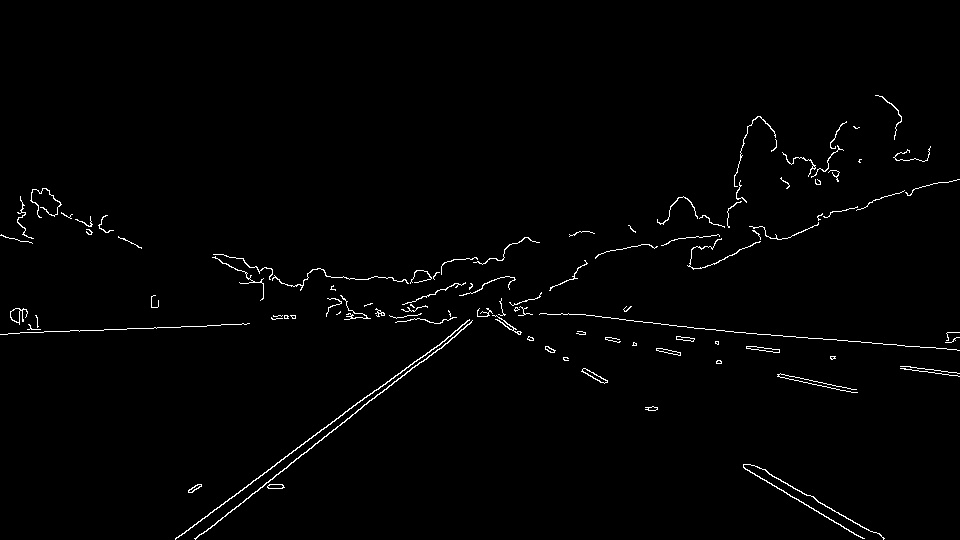
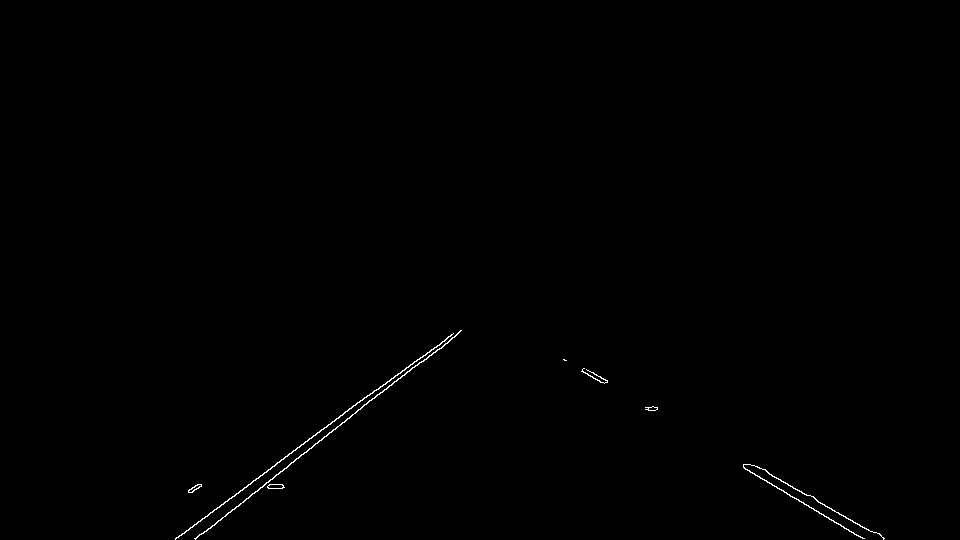
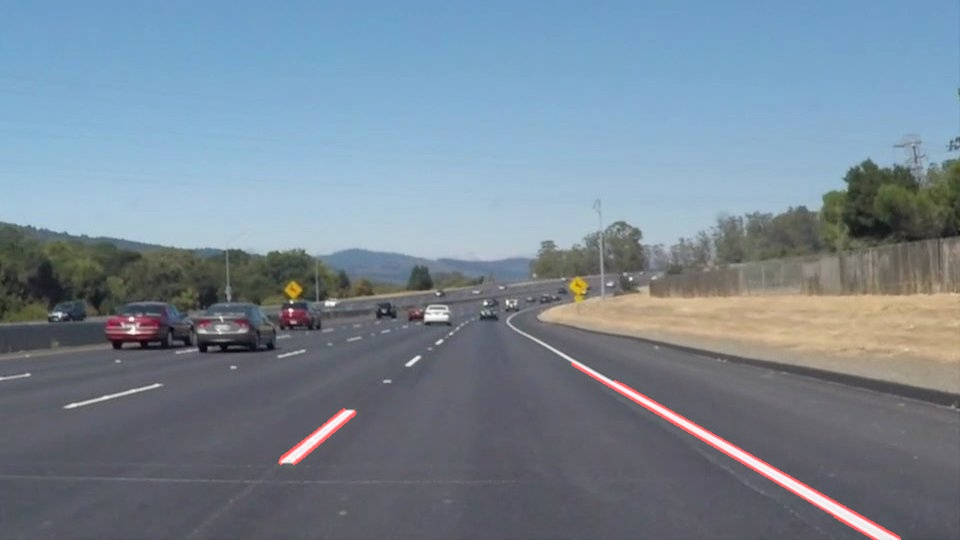
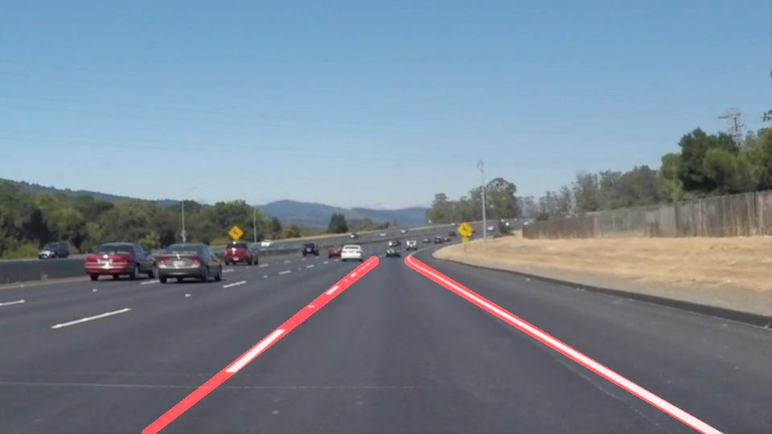

# Self-Driving Car Engineer Nanodegree


## Project: **Finding Lane Lines on the Road** 
***
In this project, the tools used are learnt in the udacity lesson to identify lane lines on the road.  A pipeline has been developed which can be used on a series of individual images, and a video stream (a series of images). 

---
**The goal of this project is to make a pipeline that finds lane lines on the road & to show extrapolate lines in the image  **

---
## Reflection

**The pipeline consist of the following steps-** 
* Grayscale conversion
* Gaussian filter
* Canny Edge Detection
* Region of Interest
* Hough Transformation
* Extrapolation
---

### Grayscale Conversion

This function converts the image from RGB to grayscale image.
By converting the image to grayscale,each pixel will have single intensity value instead of color information.
Canny edge function requires input image to be in grayscale.
Therefore,this step is mandatory before applying canny edge fuction.

```python
def grayscale(img):
    return cv2.cvtColor(img, cv2.COLOR_RGB2GRAY)
```
<figure>
 
 <figcaption>
 <p></p> 
 <p style="text-align: center;">  Grayscale image </p> 
 </figcaption>
</figure>

---

### Gaussian Smoothing

Gaussian Smoothing is used to suppress unwanted noise and spurious gradient by averaging. Kernel_size used for smoothning is 3.

```python
def gaussian_blur(img, kernel_size):
    """Applies a Gaussian Noise kernel"""
    return cv2.GaussianBlur(img, (kernel_size, kernel_size), 0)
```
Canny edge function also does gaussian smoothing .So, this step is optional. This step is added for more smoothing.

---

### Canny Edge Detection

Canny Edge Detection essentially detects areas of the image that have a strong gradient in the image’s color function.
The input parameters of this function is -
*grayscale image
*low threshold = 100
*high threshold =200

Edges below 100 pixels wil be rejected,edges above 200 pixels  are strong edges and will be detected and pixel value b/w 100 and 200 will be considered if they're connected to strong edges.
Output image has edges in white color.

```python
def canny(img, low_threshold, high_threshold):
    """Applies the Canny transform"""
    return cv2.Canny(img, low_threshold, high_threshold)
```

<figure>
 
 <figcaption>
 <p></p> 
 <p style="text-align: center;"> Canny Edge function applied </p> 
 </figcaption>
</figure>
    
---
### Region of Interest

After canny edge detection, region of interest is required to select the region where lane lines would be present.
For region of interest,different shapes can be used like triangle or any other polygon.
The shape used in this pipeline is trapezium with vertices  = (0,539),(460,320),(500,320),(960,539)
The function is used for next step in pipeline where we need to do hough line transformation.
The input of region of interest function is a canny image and output returned is lane lines which lies inside the polygon.

```python
def region_of_interest(img, vertices):

    mask = np.zeros_like(img)
    cv2.fillPoly(mask, vertices, ignore_mask_color)
    masked_image = cv2.bitwise_and(img, mask)
    return masked_image
```

<figure>
 
 <figcaption>
 <p></p> 
 <p style="text-align: center;"> Region of Interest selected </p> 
 </figcaption>
</figure>

---

### Hough Transformation

Input parameters for hought transformation function is-
* img = output from region of interest function - edges in roi 
* rho = 1
* theta = pi/180
* threshold = 30
* min_line_len = 15
* max_line_gap = 10

The output of this function is an array of x,y coordinates of the lines present in the input image.

```python
def hough_lines(img, rho, theta, threshold, min_line_len, max_line_gap):
  lines = cv2.HoughLinesP(img, rho, theta, threshold, np.array([]), minLineLength=min_line_len, maxLineGap=max_line_gap)
  return lines
```
<figure>
 
 <figcaption>
 <p></p> 
 <p style="text-align: center;"> Region of Interest selected </p> 
 </figcaption>
</figure>

---
### Extrapolation

**For extrapolation,draw_lines funtion is used.**
The input parameters of this function is -
* Original image
* Output of hough line function - lines
* Color selection for extrapolated image
* Thickness of extrapolated line

Divide the lines into left lane lines and right lane lines using slope of the line.
The lines belonging to the left lane will have negative slope and the lines belonging to right lane will have positive slopes. 
The lines having absolute value of slope less than 0.5 can be discarded as these lines will be near to horizontal side or are not moving rapidly towards vertical side.

```python
def draw_lines(img, lines, color=[255, 0, 0], thickness=12):
    left_laneX=[]
    left_laneY=[]
    right_laneX=[]
    right_laneY=[]

    for line in lines:
        for x1,y1,x2,y2 in line:
            slope = (y2-y1)/(x2-x1)
            if abs(slope)<0.5 :
                continue
            if slope<=0:
                left_laneX.extend([x1,x2])
                left_laneY.extend([y1,y2])
            elif slope>=0:
                right_laneX.extend([x1,x2])
                right_laneY.extend([y1,y2])
```


After dividing lines into left lane and right lane group,we need just one average line for each lane from bottom of the image towards the horizon .
The start point of both the lanes is the bottom of the image.So, y coordinate of start points of both lanes will be height of the image.
Height of the image can be found out by ```image.shape[0]```
The end point of both lanes will be near horizon i.e. approx 3/5 of height of the image.

So,the y coordinate of start and end point of the both the lanes are known.
We can calculate the **AVERAGE SLOPE & INTERCEPT** of both the lanes using polyfit function.
The input parameters of polyfit function for left lane will be x and y coordinates list of left lane.
And the input parameters of polyfit function for right lane will be x and y coordinates list of right lane.

As line equation is **y=mx+c** where m is the slope and c is the intercept.
We have the value for y , m and c .So, we can calculate x.

```python
f_left = np.polyfit(left_laneX,left_laneY,deg=1)  
f_right=np.polyfit(right_laneX,right_laneY,deg=1) 
    
slope_left=f_left[0]
slope_right=f_right[0]
intercept_left=f_left[1]
intercept_right=f_right[1]
    
end_y = image.shape[0] *(3/5)      # y coordinate Near the horizon
start_y = image.shape[0]           # y coordinate of bottom of the image
    
Lstart_x = (start_y - intercept_left) / slope_left
Lend_x = (end_y - intercept_left) / slope_left
    
Rstart_x = (start_y - intercept_right) / slope_right
Rend_x = (end_y - intercept_right) / slope_right
```      
To draw a single line for left lane and right lane cv2.line function is used parameters for each line are - xy coordinate for start and end point ,color and thickness

```python
extrapolate = np.zeros_like(img)
cv2.line(extrapolate,(Lstart_x,int(start_y)),(Lend_x,int(end_y)),color,thickness) # to draw left lane line
cv2.line(extrapolate,(Rstart_x,int(start_y)),(Rend_x,int(end_y)),color,thickness) # to draw right lane line  
#The function returns extrapolated lines on a blank image  
```
<figure>
 
 <figcaption>
 <p></p> 
 <p style="text-align: center;"> Extrapolation </p> 
 </figcaption>
</figure>

---
## *Possible Shortcomings*

1. Hardcoded region of Region of interest
2. Dependent of lane location in image

---
## *Possible improvement to my pipeline*
1. Use Past frame data to handle bad frames
2. Automatic selection of Region of Interest
3. Better Hough transform parameters which can handle challenge video as well
